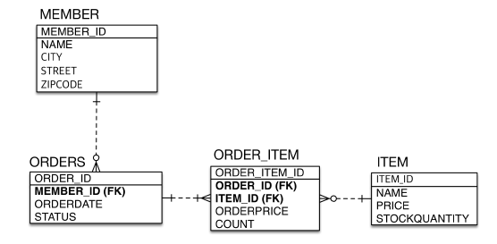
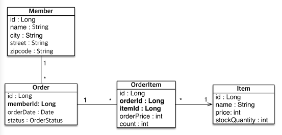

# JPAshop
---

## TABLE 설계
---


## Entity 설계와 매핑
---


## CREATE Entity result
```shell
Hibernate: 
    
    create table Item (
       ITEM_ID bigint not null,
        name varchar(255),
        price integer not null,
        stackQuantity integer not null,
        primary key (ITEM_ID)
    )
Hibernate: 
    
    create table Member (
       MEMBER_ID bigint not null,
        city varchar(255),
        name varchar(255),
        street varchar(255),
        zipcode varchar(255),
        primary key (MEMBER_ID)
    )
Hibernate: 
    
    create table OrderItem (
       ORDER_ITEM_ID bigint not null,
        count integer not null,
        ITEM_ID bigint,
        ORDER_ID bigint,
        orderPrice integer not null,
        primary key (ORDER_ITEM_ID)
    )
Hibernate: 
    
    create table ORDERS (
       ORDER_ID bigint not null,
        MEMBER_ID bigint,
        orderDate timestamp,
        status varchar(255),
        primary key (ORDER_ID)
    )

```